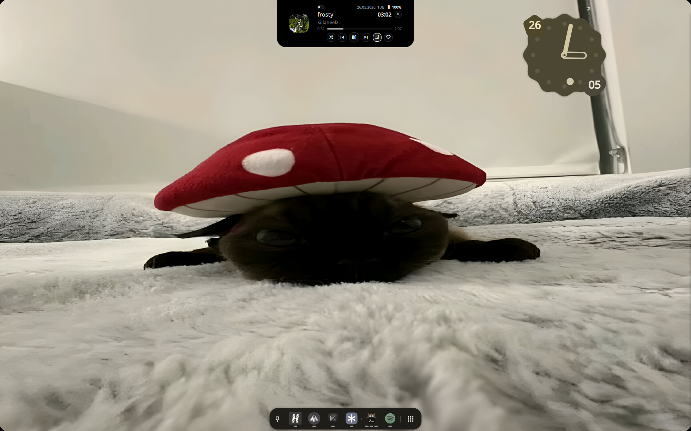
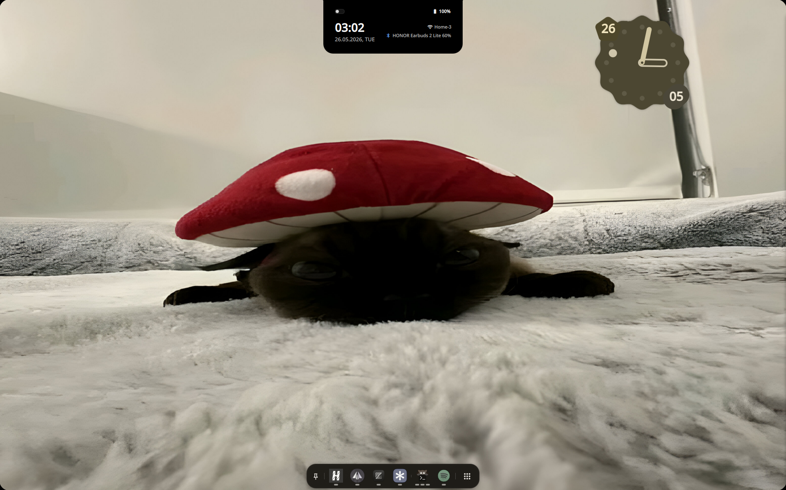
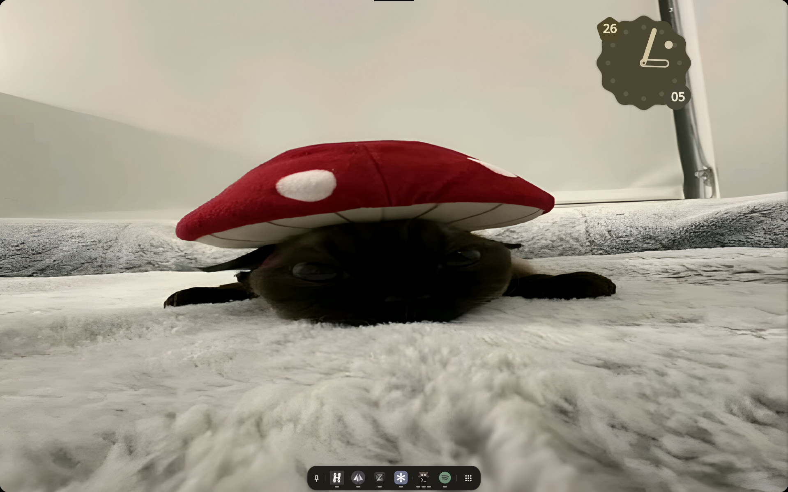

# Dynamic Glacier

Dynamic Glacier is a native QML/Quickshell island widget for Hyprland.

It is built for Linux desktops that want a compact, OLED-friendly top-center surface without Electron, webviews, AGS, EWW, or a JS/HTML/CSS UI stack. The idle state is a small black handle; it expands on hover, click, or useful desktop activity.

## Install

<details open>
<summary><b>Arch Linux / AUR</b></summary>

Install from the AUR:

```sh
paru -S dynamic-glacier-git
```

Run it:

```sh
dynamic-glacier
```

For Hyprland autostart, add this to `~/.config/hypr/hyprland.conf`:

```ini
exec-once = dynamic-glacier
```

</details>

<details>
<summary><b>Manual install</b></summary>

Clone the repository:

```sh
git clone https://github.com/mavxa/DynamicGlacier.git
cd DynamicGlacier
```

Run the installer:

```sh
bash install.sh
```

The installer:

- installs runtime dependencies on supported distros
- refreshes the font cache so `Noto Sans` is available
- installs the config into `~/.config/quickshell/DynamicGlacier`
- installs a launcher into `~/.local/bin/dynamic-glacier`
- registers `exec-once = ~/.local/bin/dynamic-glacier` in `~/.config/hypr/hyprland.conf` when that file exists

Useful installer options:

```sh
bash install.sh --symlink
bash install.sh --skip-deps
bash install.sh --no-autostart
bash install.sh --doctor
```

If your Hyprland config is not at the default path:

```sh
bash install.sh --hyprland-conf /path/to/hyprland.conf
```

</details>

<details>
<summary><b>Uninstall</b></summary>

For the AUR package:

```sh
paru -Rns dynamic-glacier-git
```

For a manual install:

```sh
bash uninstall.sh
```

Non-interactive manual removal:

```sh
bash uninstall.sh --yes
```

</details>

## Preview

<details open>
<summary><b>Screenshots</b></summary>






</details>

## Features

<details open>
<summary><b>Current features</b></summary>

- Pure-black top-center island for Hyprland.
- OLED-friendly idle handle with `bump` and barely visible `strip` modes.
- Anti-corner notch smoothly merging island into screen edge.
- Hover expansion that can overlap windows instead of constantly resizing the Hyprland layout.
- Small constant reserved zone, so normal windows do not jump around.
- Focused-monitor placement through Hyprland.
- MPRIS media player with artwork, title, artist, position, timeline, seek, previous, play/pause, next, shuffle, repeat, and favorite controls (Material Symbols icons).
- Paused tracks stay in the media state instead of immediately collapsing to idle.
- Collapsed `bump` can show current time plus track artwork/play indicator when media is active.
- Tray indicators: circular battery charging chip, cava-style audio bars.
- Subtle open U-shaped trace for volume and brightness changes.
- WiFi status (signal strength + SSID) and Bluetooth (device name + battery %) in idle mode.
- Click WiFi/BT to open settings (nmtui / bluedevil-wizard).
- Battery icon + percentage on hover through UPower.
- Microphone and camera privacy dots with separate colors and non-overlapping layout.
- PipeWire privacy detection plus local fallbacks for `pactl` microphone streams and `/dev/video*` camera users.
- Minimalist pill toggle for bump/strip mode switching.
- IPC commands for manual testing and integration scripts.

</details>

<details>
<summary><b>Customization</b></summary>

All customizable properties live in `quickshell/modules/dynamicGlacier/DynamicGlacier.qml`. You can change these without breaking anything:

| Property | Default | Description |
|----------|---------|-------------|
| `handleStyle` | `"bump"` | Idle handle mode: `"bump"` (pill) or `"strip"` (thin line) |
| `liveLinksEnabled` | `true` | Enable live MPRIS, volume, brightness, privacy detection |
| `fontFamily` | `"Noto Sans"` | Font used across the widget |
| `bumpWidth` | `104` | Width of the idle bump handle (px) |
| `bumpHeight` | `24` | Height of the idle bump handle (px) |
| `stripWidth` | `98` | Width of the idle strip handle (px) |
| `stripHeight` | `4` | Height of the idle strip handle (px) |
| `peekWidth` | `340` | Width when hovering idle (expanded peek) |
| `peekHeight` | `132` | Height when hovering idle |
| `notifyWidth` | `438` | Width of notification state |
| `notifyHeight` | `74` | Height of notification state |
| `mediaWidth` | `380` | Width of media player state |
| `mediaHeight` | `132` | Height of media player state |
| `reservedZone` | `24` (bump) / `0` (strip) | Top exclusive zone reserved for the island |
| `windowHeight` | `136` | Total window height for the layer surface |

Colors are defined inline in `IslandSurface.qml` and `IslandContent.qml`:

- `surfaceColor`: island background (`#000000` bump, `#0c0c0c` strip)
- `primaryText`: main text color (`#f7f7f7`)
- `secondaryText`: dimmed text (`#7f7f7f`)
- `microphoneIndicatorColor`: mic privacy dot (`#ff9f1a`)
- `cameraIndicatorColor`: camera privacy dot (`#35ff72`)

To change the WiFi/BT settings apps, edit these lines in `DynamicGlacier.qml`:

```qml
onWifiSettingsRequested: wifiSettingsProc.exec(["sh", "-c", "kitty --title 'WiFi Settings' nmtui-connect &"])
onBtSettingsRequested: btSettingsProc.exec(["sh", "-c", "bluedevil-wizard &"])
```

</details>

<details>
<summary><b>Planned / possible later</b></summary>

- Notification bridge that does not fight existing end-4 notification services.
- User config file for sizes, colors, modules, and timeout behavior.
- More detailed privacy labels for active microphone/camera clients.
- Long-running progress state for commands, downloads, and file operations.
- VPN/network, DND, timer, and calendar activity states.
- Optional tighter integration with end-4 dots while keeping standalone usage clean.

</details>

## end-4 Friendly

<details open>
<summary><b>How it fits next to end-4 dots</b></summary>

Dynamic Glacier is designed to run nicely next to [end-4/dots-hyprland](https://github.com/end-4/dots-hyprland).

It deliberately avoids owning global desktop services that end-4 already handles well. For example, it does not register a standalone notification daemon by default, and volume feedback is only a subtle trace around the island instead of a second full volume OSD.

The goal is to be an optional companion widget for end-4 style Hyprland setups: minimal, black, Quickshell-native, and easy to wire into an existing dotfiles tree.

</details>

## Development

<details>
<summary><b>Run from the repo</b></summary>

From the repo root:

```sh
quickshell --path quickshell
```

Trigger states from another terminal:

```sh
quickshell ipc --path quickshell call dynamicGlacier demo
quickshell ipc --path quickshell call dynamicGlacier notify "Build finished" "Dynamic Glacier is alive" "Hello"
quickshell ipc --path quickshell call dynamicGlacier media "Night Drive" "Glacier FM" true ""
quickshell ipc --path quickshell call dynamicGlacier volume 72 false
quickshell ipc --path quickshell call dynamicGlacier brightness 83
quickshell ipc --path quickshell call dynamicGlacier privacy true false
quickshell ipc --path quickshell call dynamicGlacier privacy false true
quickshell ipc --path quickshell call dynamicGlacier privacy true true
quickshell ipc --path quickshell call dynamicGlacier privacyLive
quickshell ipc --path quickshell call dynamicGlacier toggleHandle
quickshell ipc --path quickshell call dynamicGlacier live true
quickshell ipc --path quickshell call dynamicGlacier idle
```

Toggle the looping demo:

```sh
quickshell ipc --path quickshell call dynamicGlacier demoLoop
```

More developer notes are in [`docs/development.md`](docs/development.md).

</details>

<details>
<summary><b>Verify manual install</b></summary>

Run doctor mode:

```sh
bash install.sh --doctor
```

It checks `quickshell`, the installed config, launcher, `Noto Sans`, helper commands (`playerctl`, `upower`, `pactl`, `fuser`), and whether the Hyprland autostart entry is present.

</details>

## References

<details>
<summary><b>Links</b></summary>

- AUR package: https://aur.archlinux.org/packages/dynamic-glacier-git
- end-4 dots: https://github.com/end-4/dots-hyprland
- Quickshell docs: https://quickshell.outfoxxed.me/docs/
- Quickshell install/setup: https://quickshell.outfoxxed.me/docs/guide/install-setup/
- Quickshell distribution paths: https://quickshell.outfoxxed.me/docs/guide/distribution/

</details>
